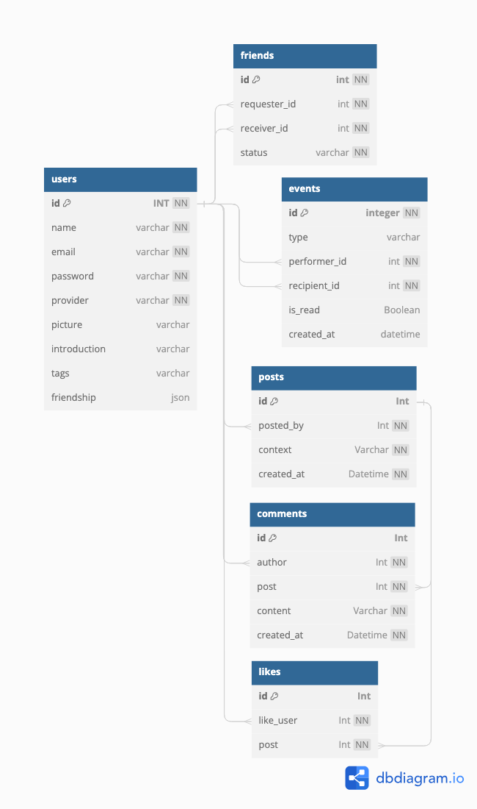

# Canchu

## Features
- Users
    - Sign up
    - Sign in/Sign in with Facebook
    - Update pictures
    - Update introduction
    - User profiles with an introduction, a picture and users' past posts
- Friends
    - Add/delete friends
    - Agree/delete friend requests
- Events
    - Send notifications when users send or accept friend requests
- Posts
    - Create posts
    - Create and delete likes
    - Create comments
    - Demonstrate user's own timeline

## Database Schema


## System Design


## Run in Docker:
Step1: Pull the repo and Switch to branch week_5_part_5
```bash
git clone https://github.com/PTC1116/Canchu.git
git checkout week5_part_5
```
Step2: Create .env file for the program 
```bash
cd Campus-Summer-Back-End/students/pei-tung/Canchu/app
vim .env
```
Step3: Create a private directory for nginx config file 
```bash
cd ../../
mkdir private
```
Step4: Move to the target directory
```bash
cd Canchu
```
Step5: Built the docker image
```bash
docker build -t canchu-server .
```
Step6: Run the program
```bash
docker compose-up -d
```

## Tech stack
- Node.js
- MySQL/Amazon RDS
- Redis
- Nginx
- Amazon EC2
- Jest
- Docker
- K6
